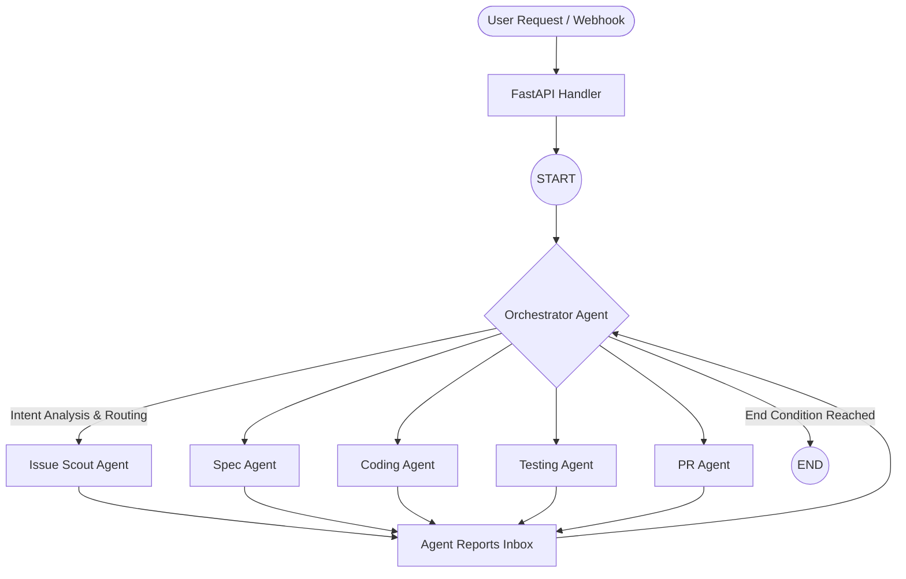

# Agent AI Project Maquette

## Overview

This project is a sophisticated **Multi-Agent AI Development System** orchestrated by **LangGraph**. It automates the end-to-end software development lifecycle—from interpreting a GitHub issue or user request, writing technical specifications, implementing the code, running tests inside an isolated Docker sandbox, and ultimately submitting a Pull Request.

The application leverages a high-performance **FastAPI** backend to expose workflow triggers and health checks, and it provides a flexible, provider-agnostic LLM configuration layer.

---

## High-Level Architecture

The system is built on a structured loop architecture using LangGraph, where an **Orchestrator Agent** acts as the central brain routing work to specialized sub-agents. 



### Flow of Execution

1. **Initial Triggering**: Requests arrive via FastAPI pointing to LangGraph's entry point (`main.py` -> `src/api/routes`).
2. **Orchestrator Intelligence**: The Orchestrator (`src/agents/orchestrator_agent.py`) reads the incoming issue/ticket. Based on the "Intent" (e.g., `QUESTION`, `CODING_WITH_SPEC`, `STANDARD_FLOW`), it establishes a dynamic execution pipeline.
3. **Agent Delegation**: The Orchestrator delegates tasks to designated agents. Each task completion creates an `AgentReport` appended to the global state (`GraphState`).
4. **Dynamic Routing**: After an agent completes its turn, execution flows back to the Orchestrator, which assesses the latest `AgentReport` within the `orchestrator_inbox` and determines the subsequent step (advance to the next agent, retry, escalate to human review, or end).

---

## The Agents

All specialized agents inherit from a unified `BaseAgent` (`src/agents/base_agent.py`) implementation. `BaseAgent` provides the foundational asynchronous loop, tool binding (including MCP tools), token tracking, logging, and automatic "nudging" mechanisms (e.g., reminding an LLM to take an action if it stalls).

### 1. Orchestrator Agent (`orchestrator_agent.py`)
- **Role**: The brain of the operation.
- **Function**: Determines intents and decides the graph's control flow using LLM reasoning over `AgentReport` objects. 
- **Decisions**: Outputs explicit next nodes (`spec_agent`, `coding_agent`, `testing_agent`, `pr_agent`, `retry`, `human_review`, or `end`).

### 2. Issue Scout Agent (`issue_scout/`)
- **Role**: Context gathering.
- **Function**: Analyzes a repository, locates necessary context, pulls down the relevant open issues or specific bugs to fix, and aggregates it into the pipeline state.

### 3. Spec Agent (`spec_agent.py`)
- **Role**: Technical design.
- **Function**: Takes user requests and drafts a formal technical specification (`spec`). Outlines architecture, variables, constraints, and instructions for the coding agent.

### 4. Coding Agent (`coding_agent.py`)
- **Role**: Implementation.
- **Function**: Provided with the brief/spec, it binds natively to coding tools (File parsing, AST Analysis). It executes the actual file modifications and system commands to develop the feature or bug fix.

### 5. Testing Agent (`testing_agent.py`)
- **Role**: Validation.
- **Function**: Employs an isolated Docker sandbox (`src/tools/docker_sandbox.py`). It writes test cases or commands, pushes them to the sandbox, captures `stdout`/`stderr`, and validates success metrics without affecting the host machine.

### 6. PR Agent (`pr/`)
- **Role**: Deployment.
- **Function**: Uses Git and GitHub/GitLab utilities to stage, commit, and push changes to a remote branch, eventually opening a formatted Pull Request incorporating execution logs and summaries.

---

## State Management

The orchestrator and agents communicate via `GraphState`, defined in `src/state.py` as a `TypedDict`. This ensures highly typed schema validation during the LangGraph cycles.

**Key State Properties:**
- **Execution Metadata**: Token counts, iteration steps, logs.
- **Agent Communication**: The chronological list of `agent_reports` and the current `orchestrator_inbox`.
- **Project Domain**: Revisions of the technical `spec`, raw `ticket_text`, active `branch_name`.
- **Environment Specs**: Model profile limitations (`MAX_TOOL_OUT`, etc.) and dynamically discovered `mcp_servers` configurations.
- **Pipeline Data**: Progress of the execution (`pipeline_step`, `next_node`).

---

## Tooling & Capabilities 🛠️

Tools in `src/tools/` encapsulate discrete functionalities passed to agents natively or via MCP.

1. **Docker Sandbox (`docker_sandbox.py`)**: A secure container builder that safely runs untrusted or freshly generated code.
2. **Model Context Protocol (MCP)**: Native integration handling abstract tool fetching dynamically (`src/mcp/client.py`).
3. **AST Analysis (`ast_tools.py`)**: Deep syntactical tree inspection to pinpoint functions, variables, and code architecture across multiple languages.
4. **Graph RAG / Search (`graph_rag_tools.py`, `search_tools.py`)**: Knowledge base querying spanning code relations, leveraging NetworkX and structural parsing.
5. **VCS Integration (`github/`, `gitlab/`)**: Handles cloning, branching, fetching PR issues, pushing code, and creating structured PR requests securely.
6. **Linter Tools (`linter_tools.py`)**: In-band feedback loops validating code syntax before tests execute.

---

## Dynamic LLM Configuration & Model Profiling

Configuration logic handles plug-and-play LLM switching depending entirely on `.env` settings (`src/config/llm.py`). Supported configurations include:
- Google Gemini (`gemini-2.5-flash`)
- OpenAI / Groq / OpenRouter / Ollama / LM Studio.

### Model Profiles (`MODEL_PROFILE`)
To stabilize performance across varying model capabilities (from 2B local models to 70B+ API models), the system implements adaptive profiles:
* **LOW**: Restricts history, context length, and tool output thresholds (optimized for 2B - 4B param models).
* **STANDARD**: Balanced constraints suitable for typical tasks (7B - 14B models).
* **HIGH**: Extremely wide contexts and aggressive output limits (27B - 70B+ capabilities).
* **CUSTOM**: Driven entirely by explicitly declared constraints in `.env`.

---

## Package and Class Descriptions

### 1. `src.agents`
This package contains the core business intelligence of the workflow. Each class maps to an autonomous LangGraph node.
- **`BaseAgent` (in `base_agent.py`)**: The abstract base class that provides the foundation for the agents. It orchestrates the internal turn-based LLM loop, logs tracking, parses and manages `AgentReport` outputs to the Orchestrator, formats prompt nudges if tests aren't run or files aren't edited, and acts as the universal schema adapter.
- **`IssueScoutAgent`**: Derives from `BaseAgent`. Handles information gathering on GitHub/GitLab repositories.
- **`SpecAgent`**: Derives from `BaseAgent`. Generates robust system instructions, APIs, and plans depending on the user narrative.
- **`CodingAgent`**: Derives from `BaseAgent`. Leverages LLM reasoning combined with search and file I/O capabilities to enact coding tasks.
- **`TestingAgent`**: Derives from `BaseAgent`. Orchestrates Docker environments and writes Python/Node modules to validate if the written code functions as requested.
- **`PRAgent`**: Derives from `BaseAgent`. Opens remote branches, runs git operations, and finalizes logic with pull requests.

### 2. `src.api`
Manages FastAPI endpoints mapping out to workflow triggers and standard health-checks.
- **`create_app` (in `app.py`)**: A setup factory function defining FastAPI properties, wiring routes and exposing the core system.
- **`routes.health`**: Contains `/health` basic connectivity diagnostics routing.
- **`routes.workflow`**: Entrypoint hooks initializing a LangGraph invoke (`GraphState` inputs), spawning background execution of a pipeline.

### 3. `src.config`
Bootstraps application state, LLM singletons, prompt schemas and limits based on host OS paths and environment strings.
- **`AgentConfig`**: Class abstracting `prompt/` directory mapping. Extends functionality to automatically read user-level `system.yaml`, `human.yaml`, `nudges.yaml`, and load them smoothly with context injection mapping.
- **`get_llm` (in `llm.py`)**: Provider factory function that parses configuration rules mapped inside `.env` to build a standardized LangChain Chat Object (`ChatOllama`, `ChatGroq`, `ChatOpenRouter`, etc).
- **`language_config.py`**: Resolves execution contexts and commands for Java/Python/Node specific sandbox testing.
- **Modules (`paths.py`)**: Defines `Path` objects matching where to load datasets, temporary directories, or environments globally safely.
- **Config (`config.py`)**: Security configuration of the application like CORS and other security settings. (not used yet)


### 4. `src.mcp`
Handles integration of dynamic off-host capabilities leveraging Model Context Protocol rules.
- **`MCPClientManager`**: A class that encapsulates asynchronous requests mapping `langchain-mcp-adapters`. Provides standard `get_tools()` method for agents resolving against configured `.env` connections dynamically. Supports SSE, stdio, HTTP transport wrappers.

### 5. `src.tools`
A suite of modular operations registered natively alongside LangChain tool-calling APIs to enact system operations.
- **Docker (`docker_sandbox.py`)**: Maps out container logic. Runs isolated ephemeral builds.
- **Graph RAG / AST (`graph_rag_tools.py`, `ast_tools.py`)**: Syntactical tree walking tools parsing source structures into semantic meaning.
- **File & Code Actions (`file_tools.py`)**: `write_to_file`, `grep_search`, `read_tool` primitives.
- **VCS Helpers (`github/`, `gitlab/`)**: Tools specific to making interactions with API issues and pull requests secure and isolated.

### 6. `src.utils`
Commonly accessed utility logic.
- **`language_detector.py`**: Automatically scopes standard project files (`pom.xml`, `package.json`, `setup.py`) to infer the runtime.
- **`logger.py`**: Detailed file and token streaming formatters exporting logs.

### 7. LangGraph Orchestration (`src.graph` & `src.state`)
- **`GraphState` (`state.py`)**: A `TypedDict` establishing strict static type semantics matching payload structures for everything flowing to and from the Orchestrator, preventing execution ambiguity.
- **`build_graph` (`graph.py`)**: Returns a `StateGraph` object wiring conditionals: `START -> Orchestrator -> {Agent Nodes} -> Orchestrator -> END`.

---

## Directory Structure Breakdown

```text
.
├── main.py                     # App entry point (Starts Uvicorn server)
├── .env                        # Environment variables (Not versioned - local only -should be created)
├── .env.example                # Example environment variable declaration
├── .gitignore                  # Git ignore file (NOT VERSIONED - local only -should be created)
├── README.md                   # README file for details of the application
├── requirements.txt            # Python dependencies
├── Dockerfile                  # Dockerfile for building the application
├── docker-compose.yml          # Docker-compose file for running the application
├── logs/                       # Logs of the application
│   ├── chatLogs/               # Struct/Type definitions for GraphState context
│   │   └── chatLog-{date}.log  # Detailled logs of the agent responses
│   └── log-{date}.log          # Logs of the application (consumption of tokens, time, etc.)
├── src/
│   ├── api/                    # FastAPI routes / REST interface 
│   │   ├── app.py              # App factory 
│   │   ├── routes/             # REST API specific sub-routers
│   │   └── schemas/            # Pydantic validation schemas
│   ├── agents/                 # The core domain agents 
│   │   ├── base_agent.py       # Core base logic, looping, and tool integration
│   │   ├── orchestrator_agent.py # The planner / router LLM 
│   │   ├── coding_agent.py     # The coding LLM 
│   │   ├─ pr_agent.py         # The PR LLM 
│   │   ├── issue_scout_agent.py # The issue scout LLM 
│   │   └── spec_agent.py       # The spec LLM 
│   ├── config/                 # Dynamic system & agent bootstrapping configurations
│   ├── mcp/                    # Seamless Model Context Protocol integration clients
│   ├── tools/                  # Docker, GitHub, GraphRAG, AST, File modification
│   ├── utils/                  # Universal logger, string format utilities
│   ├── graph.py                # LangGraph definition, adding nodes and edges
│   └── state.py                # Struct/Type definitions for GraphState context
├── resources/                  # Potential hardcoded templates, system prompts, data
│   ├── agents/                 # The core domain agents with their prompts (human.yaml, nudges.yaml, system.yaml, etc.)
│   │   ├── coding_agent/
│   │   │   └── prompts/        
│   │   │       ├── human.yaml
│   │   │       ├── lang_note.yaml
│   │   │       ├── nudges.yaml
│   │   │       ├── suffixes.yaml
│   │   │       └── system.yaml
│   │   ├── testing_agent/
│   │   │   └── prompts/
│   │   │       ├── human.yaml
│   │   │       ├── language_runners.yaml
│   │   │       ├── nudges.yaml
│   │   │       ├── qa_tools.yaml
│   │   │       └── system.yaml
│   │   ├── pr_agent/   
│   │   │   └── prompts/
│   │   │       ├── human.yaml
│   │   │       ├── nudges.yaml
│   │   │       └── system.yaml       
│   │   ├─ issue_scout/
│   │   │   └── prompts/
│   │   │       ├── human.yaml
│   │   │       ├── nudges.yaml
│   │   │       └── system.yaml                  
│   │   └── spec_agent/      
│   │   │   └── prompts/
│   │   │       ├── human.yaml
│   │   │       ├── lang_note.yaml
│   │   │       ├── nudges.yaml
│   │   │       ├── suffixes.yaml
│   │   │       └── system.yaml     
│   └── languages/              # Prompt helpers for different languages (Java, Python, Node, etc.)
│       └── default.yaml        # Default helper for configuring the sandbox script.sh
│       └── {language}/         # Language helper files where you define language best practices, idomatic code, etc.
│           ├── hints.yaml      # Default helper for configuring the sandbox script.sh
│           └── documentation/  # Documentation of the practices used by the enterprise
├── workspace/                  # Workspace for all the applications (Temporar solution)
│   └── {repo_name}/            # Repository name specific workspace (temporary solution)
└── tests/                      # Application test suites

```

---

## Operational Mechanics

1. **Nudging Logic**: If a model loops endlessly or forgets to call tools (or write tests), `BaseAgent` intervenes, appending a "nudge" into the LLM context to prompt specific actions.
2. **Interrupts / Human Review**: By routing to `"human_review"`, LangGraph sets `interrupt_before`, freezing state until a human user resolves roadblocks or inspects artifacts directly.
3. **Tracking & Observability**: Integration with local logging dumps and LangSmith ensures full traceability over tokens out, time-spent, and AST operations run in-band.
